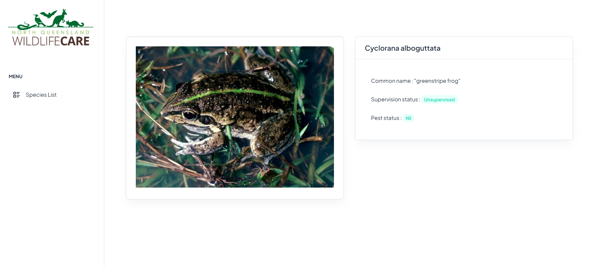

# Queensland wildlife api integration
This interface allows to explore the queensland's wildlife api. 

## Table of Contents
- [Installation](#installation)
- [Features](#features)

## Installation
1. Clone the repository:
```bash
 git clone https://github.com/karanilow/wild-life-integration.git
```

3. Run the application with the command `npm start` or `ng serve` in the `wild-life-integration` folder.


## Features
- Dynamic dropdownlists of "Kingdom", "Class" and "Family"
- List Species by Family.

- Visualize the detail of a specie : it's common name, supervision status and pest status.


